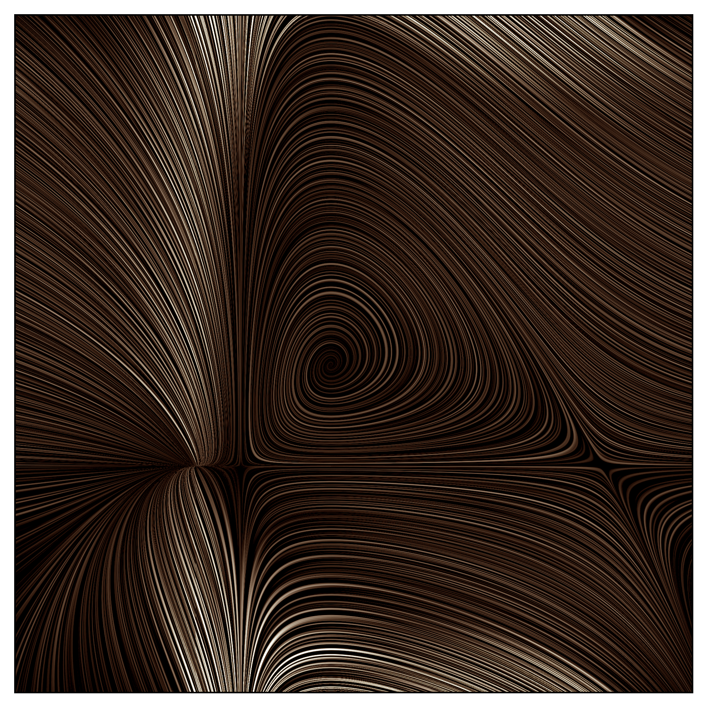

# Line Integral Convolution (LIC)

LICs are an amazing way to visualise 2D vector fields, and are widely used in many different fields (e.g., weather modelling, plasma physics), however I couldn't find a simple, up-to-date implementation, so I wrote my own. I hope you can find it useful.

Here, you can see the LIC applied to two different vector fields:
- Left: Lotka-Volterra equations
- Right: Gaussian random field where both components are independent

<div style="display: flex; justify-content: space-between;">
  
  
</div>


## Installation

### 1. Clone the repository:

```bash
git clone git@github.com:AstroKriel/line-integral-convolutions.git
cd line-integral-convolution
```

### 2. Set up a virtual environment (optional but recommended):

```bash
python -m venv venv
source venv/bin/activate # on Windows, use venv\Scripts\activate
```

### 3. Install dependencies:

```bash
pip install -r requirements.txt
```

### 4. Try out the demo-script

Run the demo script `examples/example_lic.py` which demonstrates how the LIC code can be applied to a vector field (the example file uses the Lotka-Volterra system). You can experiment by modifying the script or play around by adding your own vector fields!

```bash
python examples/example_lic.py
```

## File Structure

```bash
line-integral-convolution/
├── src/                 # Core package
│   ├── __init__.py      # Package initialization
│   ├── fields.py        # Vector field generation
│   ├── lic.py           # LIC computation
│   ├── utils.py         # Utility functions
│   └── visualization.py # Plotting functions
├── examples/            # Example scripts
│   └── example_lic.py   # Demonstrates LIC usage
├── requirements.txt     # Dependencies for the project
├── setup.py             # Installation and package setup
├── LICENSE              # Project license
└── README.md            # Project documentation (this file)
```

## License

This project is licensed under the MIT License - see the LICENSE file for details.
